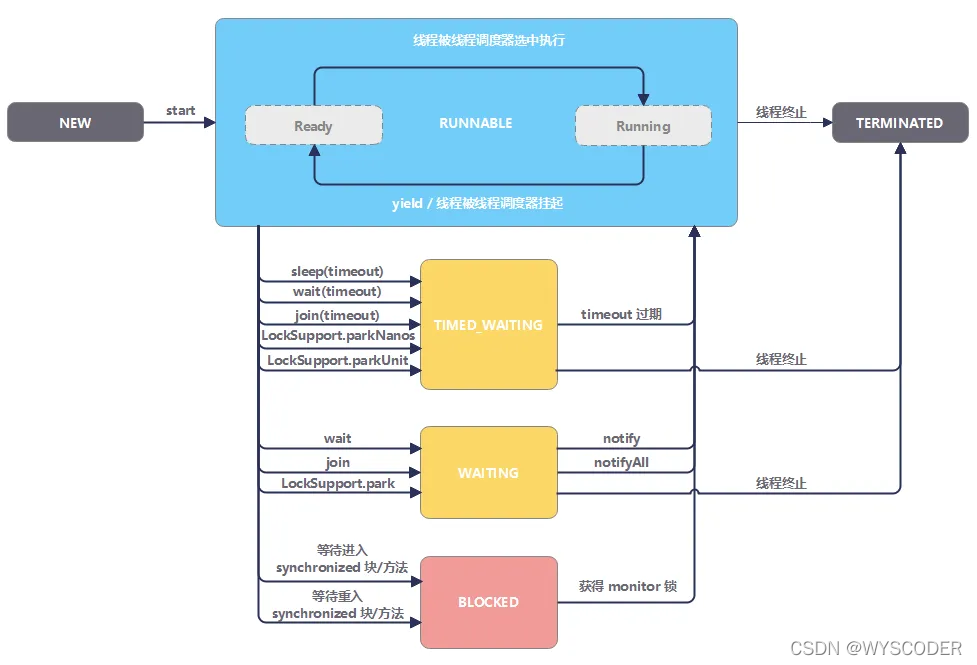

1.当JVM运行一个.java文件，JVM是一个进程，会开启主线程去运行main方法。
同时开始一个垃圾回收线程负责看护。
2.在java语言中：线程A和线程B，堆内存和方法区共享，但是栈内存独立，一个
线程一个栈。
3.java三大变量
        （1）实例变量：在堆中，只有一个。
        （2）静态变量：在方法区，只有一个。
        （3）局部变量：在栈中。
局部变量不会存在线程安全问题：因为局部变量在线程层面不共享（一个线程一个栈）
堆和方法区都是多线程共享的，所以可能存在线程安全问题。

线程状态：
        1.创建
        2.就绪
        3.运行
        4.阻塞
        5.终止
就绪状态：处于可以抢夺cpu时间片，抢到执行run方法。

