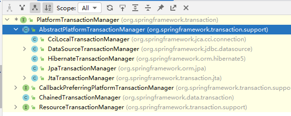
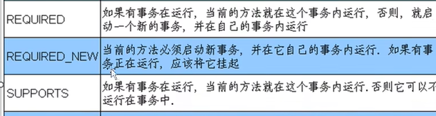

事务特性：1.原子性 2.一致性 3.隔离性 4.持久性

事务管理器，PlatformTransactionManager接口，提供很多实现类

事务传播行为（propagation）：两人之间的事务传播，a事务方法调用b事务方法，

事务隔离性（isolation）：多事务操作之间不会产生影响，

    三个读问题：脏读、不可重复读，幻读
    脏读：一个未提交的事务读取了另一个未提交事务的数据，重点在于:未提交
    不可重复读：一次事务中同一个sql查询，第1次和第2次读取的值不一样。
    幻读：指的是一个事务在前后两次查询同一个范围的时候,同一sql结果集不一样，新增或者删除

Read UnCommitted(读未提交)     什么都解决不了
Read Committed(读提交)  一个事务不能读取未提交事务的变更数据         解决脏读
Repeattable Read(可重复读，mysql默认事务隔离等级)  当事务查询某一记录,禁止其他事务对次记录的操作,行锁    解决，脏读、不可重复读
SERIALIZABLE(序列化) 一个事务对一张表操作，禁止其他事务操作该表，表锁

tiemout：超时时间，一定时间内提交，超时就回滚，默认值:-1 不超时，单位秒

readOnly：只读操作。默认是false，

rollbackFor ：出现哪些异常，回滚

norollbackFor ：出现哪些异常，不会滚
